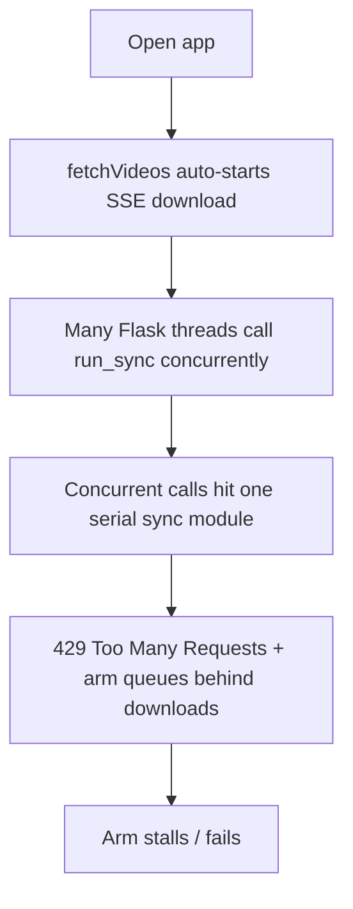
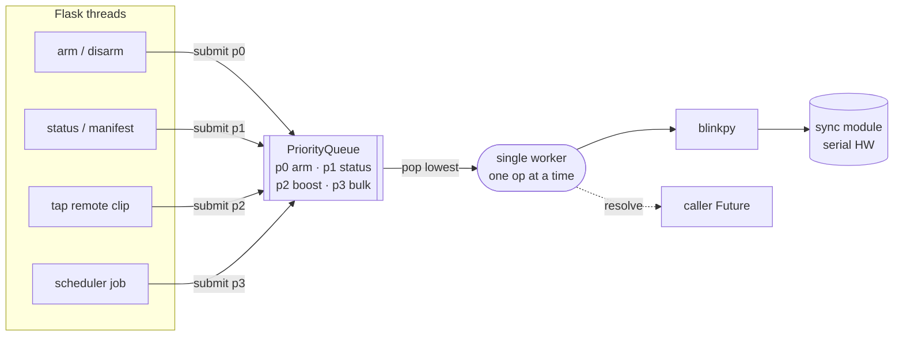
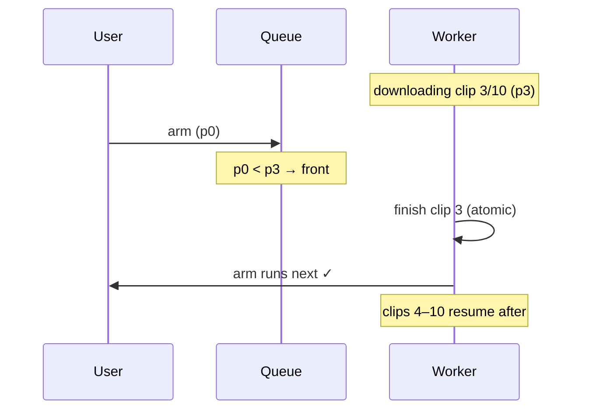
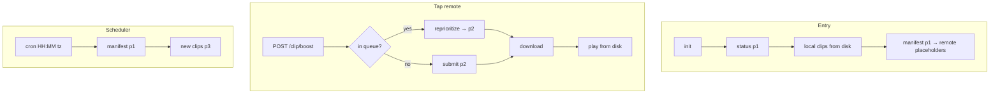
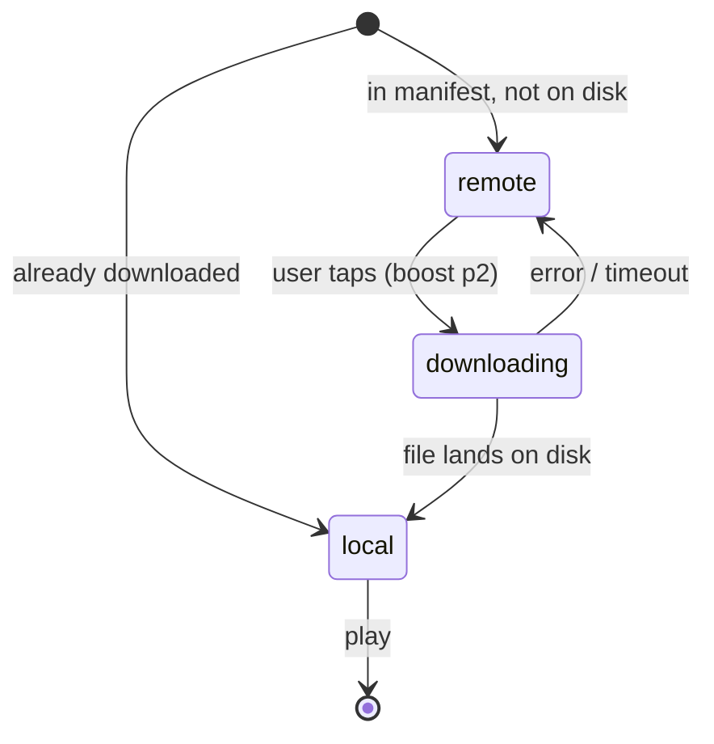

# Serialized Blink Operation Queue & Scheduled Downloads

All Blink operations run through one serialized priority queue. Arm/disarm get top
priority; downloads move off the critical path (on-demand or a daily scheduler).
Result: fast, reliable arming and no concurrent-request rate limiting.

## Problem

Opening the app to arm/disarm stalled for minutes or failed. Three compounding causes:

Verified against `blinkpy`:

| Operation | Path | Cost |
| --- | --- | --- |
| `update_local_storage_manifest` | `sync_module.py:425` | 2 round-trips, backs off only if busy. **Cheap.** |
| `prepare_download` | `sync_module.py:705` → `api.py:712` | Polls `MAX_RETRY=120` × `1s` = **up to 120 s/clip** (device→cloud upload). |
| `request_system_arm` | `api.py:222` | **Same** `wait_for_command`, same network. |

`arm` and `prepare_download` share one command channel on one serial device, and
there is **no cancel endpoint** in `blinkpy`. Stopping the poll doesn't free the
device — it keeps uploading. So the physical floor on arm latency is **one clip's
upload time**; nothing can beat that except not running downloads while arming.

## Architecture

One worker on the existing background loop drains an `asyncio.PriorityQueue`. Every
Blink call goes through it, so two never overlap.

Queue entries are `(priority, sequence, key)` — the monotonic `sequence` gives FIFO
within a priority without comparing coroutines.

**Arm latency guarantee** — arm enqueued mid-download finishes only the in-flight clip,
then jumps the queue:

## Priorities

| P | Operation | Why |
| --- | --- | --- |
| 0 | arm / disarm | User-facing, must never wait behind downloads |
| 1 | manifest / status / network / refresh | Cheap reads, keep UI fresh |
| 2 | boosted clip (user tapped) | Wanted now, but never before arm |
| 3 | bulk clip (scheduler) | Background, lowest |

## Components

| File | Role |
| --- | --- |
| `app/services/blink/queue.py` | `BlinkQueue`: priority heap + worker; `submit` / `submit_nowait` / `reprioritize`; dedup by key. Knows nothing of clips/arming. |
| `app/services/blink/__init__.py` | Exposes `service.submit/…`; `start_from_credentials`. |
| `app/services/blink/downloads.py` | `download_one_clip` + file/metadata helpers (was duplicated 3×). |
| `app/services/blink/bulk.py` | Scheduler job: manifest (p1) + per-clip (p3, keyed). |
| `app/services/settings.py` | `Settings` load/validate/save (`HH:MM` + `zoneinfo`). |
| `app/services/scheduler.py` | `DownloadScheduler` (APScheduler, reschedulable). |
| `app/api/endpoints.py` | Routes Blink ops via queue; `+/settings`, `+/clip/boost`, `+/local/remote`. |
| `app.js` + `dashboard.html` | Clip states, tap-to-boost, settings modal. |

`BlinkQueue` is domain-agnostic; `download_one_clip` is queue-agnostic — each tested alone.

## Flows

Clip lifecycle in the UI:

## Edge cases

| Case | Handling |
| --- | --- |
| Worker job raises | Caught per-job; exception → caller Future; worker survives. `CancelledError` cancels the Future and re-raises. |
| `prepare_download` fails | blinkpy retries; then Future errors, clip stays `remote`, partial file removed. |
| 429 | Prevented by serialization; if seen, backoff + 1 retry. |
| Scheduler fires, Blink offline | Job tries `start_from_credentials`; needs 2FA → skip + log. |
| Invalid config | Rejected pre-save (`HH:MM` + `zoneinfo`) → `400`, scheduler unchanged. |
| Duplicate clip | `key = "module:clip_id"` → enqueued once (tap + bulk dedup). |
| Server restart | Queue is in-memory; interrupted downloads resume next scheduler/tap. |

## Out of scope (YAGNI)

Tee streaming (boost replaces it) · cancelling in-flight downloads (device work isn't
abortable) · persisting the queue · a separate "download on entry" toggle (scheduler replaces it).
